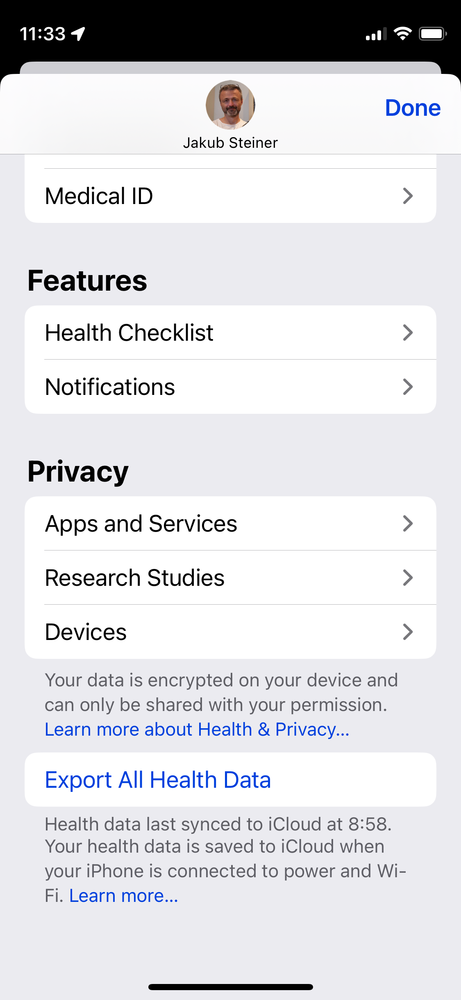

# Apple Health XML Export Parser
Parse apple health XML export file for useful summaries. To export the data, in your iOS Health app, tap on your avatar and choose `Export All Health Data`. 



Extract the `.zip` file and call the script, passing the year and the `export.xml` as a parameter:

```
python3 ./parse-apple-health-sax.py 2023 ~/Downloads/apple_health_export/export.xml
```
